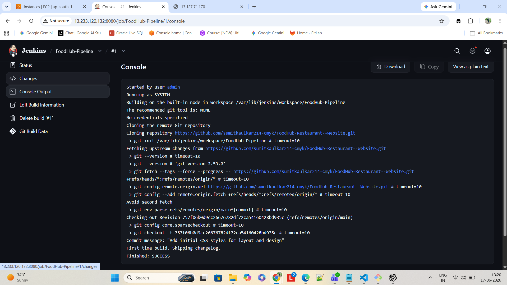

# jenkins-test

1 What is Jenkins mainly used for?
ANS-B) Continuous Integration and Continuous Delivery
2 Which type of job allows you to define build steps using code
in Jenkins?
ANS-B) Pipeline Project
3 Which file is used to define a pipeline in Jenkins?
ANS-C) Jenkinsfile
4 What is the purpose of a Jenkins Agent (Node)?
ANS-B) To execute jobs assigned by the Jenkins controller
5 Which plugin is required to connect Jenkins with GitHub?
ANS- B) Git Plugin
6 What is the purpose of a Webhook in Jenkins CI/CD
ANS- B) To trigger build automatically on code push
7  Which command is used inside Jenkins Pipeline to execute
shell commands?
ANS-C) sh
8 What is the purpose of post block in Jenkins Pipeline?
ANS-B) Execute steps after pipeline stages
9 What is the use of sshagent in Jenkins Pipeline?
ANS-C) Use stored SSH credentials during execution
10  What happens if a stage fails in Jenkins Pipeline (by default)?
ANS-B) The pipeline stops execution


# Jenkins CI/CD Practical Test: Automated Multi-App Deployment

## 📝 Objective
As a Junior DevOps Engineer, the goal of this project was to set up a complete CI/CD pipeline using Jenkins to automatically deploy two static web applications (FoodHub and ShopEase) onto the same target server using Nginx, triggered automatically via GitHub Webhooks.

---

## 🏗️ Architecture & Infrastructure Setup

Two Linux (EC2) servers were provisioned for this project:

1. **Jenkins Server:**
   * Installed Java & Jenkins.
   * Installed required plugins (Git, Pipeline, SSH Server, etc.).
   * Configured SSH credentials to connect to the Target Server.
   * **Screenshot - Jenkins Login:**
     

2. **Target Server (Web Server):**
   * Installed Nginx.
   * Opened Port 80 in Security Groups.
   * Created deployment directories: `/var/www/html/foodhub` and `/var/www/html/shopease`.
   * Configured permissions to allow Jenkins to copy files via SSH.

---

## 🚀 CI/CD Pipelines

Two separate Jenkins Pipeline jobs were created to handle the deployments independently.

### 1. FoodHub Pipeline
* **Source:** https://github.com/sumitkaulkar214-cmyk/FoodHub-Restaurant--Website.git
* **Pipeline Name:** `FoodHub-Pipeline`
* **Workflow:** Clones the repository, copies files to `/var/www/html/foodhub` on the target server, and restarts Nginx.
* **Screenshots:**
  * **Pipeline Dashboard:**
    
  * **Console Output (Git Clone Success):**
    

### 2. ShopEase Pipeline
* **Source:** https://github.com/sumitkaulkar214-cmyk/ShopEase-Website.git
* **Pipeline Name:** `shop-pipeline`
* **Workflow:** Clones the repository, copies files to `/var/www/html/shopease` on the target server, and restarts Nginx.
* **Screenshot:**
  * **Pipeline Dashboard:**
    

---

## ⚙️ Deployment & Nginx Configuration (Bonus Task)

Both applications were deployed on the **same target server** using the **same port (80)**, segregated by subdirectories.

**Nginx Configuration (`/etc/nginx/sites-available/default`):**
```nginx
server {
    listen 80 default_server;
    listen [::]:80 default_server;

    root /var/www/html;
    index index.html index.htm index.nginx-debian.html;

    server_name _;

    location /foodhub {
        alias /var/www/html/foodhub/;
        index index.html;
    }

    location /shopease {
        alias /var/www/html/shopease/;
        index index.html;
    }
}
